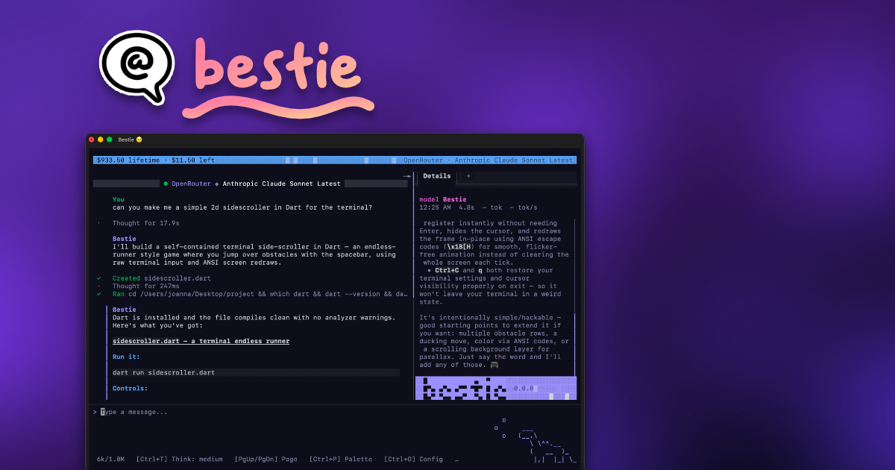

# 🥺 Bestie

![made_in_minnesota_badge] [![License: MPL 2.0][license_badge]][license_link] [![style: very good analysis][very_good_analysis_badge]][very_good_analysis_link]

Bestie is a native terminal coding agent harness that gives you total visibility into what it's doing. Bestie can't sneak anything past you.

https://github.com/user-attachments/assets/11e6ffce-0eb2-46d5-a97b-fa9d3fbb1ef9

Bestie supports Windows x64, Apple Silicon, and Linux x64.

🦾 Bestie is for people who want total power over robots.

...and **Bestie is brand new and should be considered to be in alpha still.** 🤓

You can help! Try it out, file some issues, write some code, or send me an angry letter!



## 💖 Highlights

- 🥹 For users:
  - [x] 🔍 details pane with inputs/outputs for every action visible
  - [x] 📦 cross-platform sandbox
    - [x] 🔒 wide read access, limited writes to directory
    - [x] 🌐 configurable network access levels
  - [x] 🎨 command palette
  - [x] 💾 session save and load
  - [x] 🔌 providers:
    - [x] 🎆 fireworks.ai
    - [x] 🛣️ openrouter.ai
    - [x] 🏠 OpenAI-compatible servers
  - [x] 🖥️ terminal emulator / multiplexer (for your convenience)
- 🤖 For robots:
  - [x] ⏳ background jobs
  - [x] 🐚 agentic terminal shells
  - [x] 👥 subagents
  - [x] 🗜️ compaction (automatic and at-will)
  - [x] 🏖️ sandbox-able bash environment provided for every OS
  - [x] 🧵 parallel tool execution / thread pools
  - [x] 🪝 pull-based paradigm for long outputs and shell processes
  - [x] 🌍 Internet access with [curl-impersonate](https://github.com/lwthiker/curl-impersonate) to reduce likelihood of getting captcha'd
- ✨ Just-cuz:
  - [x] 🎭 themes
  - [x] 🐮 mascot characters
  - [x] 🧮 ASCII math renderer (yup!)
  - [x] 🎛️ visual options menu (in case you're tired of staring at json)
  - [x] 📜 terminal and markdown text reflowing w/ scroll position preservation
  - [x] 🖱️ mouse support

## 🛣️ Roadmap

- [ ] agent client protocol (ACP)
- [ ] model context protocol (MCP)
- [ ] skills
- [ ] agents.md
- [ ] localization
- [ ] inline skill references / text field improvements
- [ ] plans and todo's

^ I need time to make sure these get done well.

## 📦 Install from Binary

```sh
curl -fsSL https://raw.githubusercontent.com/jolexxa/bestie/main/install.sh | bash
```

This downloads the latest release for your platform and installs it to `~/.local/bin/`.

> [!NOTE]
> Windows users should have developer mode turned on. They will also need to approve a one-time elevation prompt on the first run and wait a few minutes for the one-time sandbox initialization to complete (it takes a bit to provision wide-read access on Windows). On better operating systems, the first startup is instantaneous after any OS-notarization verifications complete (looking at you, Apple).
>
> Lastly, Windows users will be subjected to a (typically shorter) additional sandbox setup per-directory the first time bestie runs in that directory, with wait time depending on the contents. If you don't like this, please use a better (unix) operating system. Our sandbox approach was chosen for its simplicity and compatibility with Windows 10, in addition to only requiring administrator elevation on the very first run of the app.

## 😭 On Creating Coding Agents

I would have never attempted to create a coding agent if I had known how difficult it was.

In addition to complex terminal UI demands (text selection, markdown renderers, terminal multiplexing), there are many other systems, like provider management, tool execution, sandboxing, conversation compaction, external API's, and configuration systems with complex disk management, network, memory, and state management constraints.

On top of all that, Bestie supports Windows, macOS, and Linux, meaning that it has to be structured in such a way that each abstraction has specific implementations for platform-aware code (of which there is a lot). The way in which pseudo-terminals, system information, clipboards, dynamic library resolution, process spawning, and sandboxes are handled varies wildly across each operating system. Finding the right shape requires a mind-numbing amount of refactors.

Finally, Bestie contains a large amount of tool scripts for resolving external native libraries and supporting executables, generating acknowledgements, providing third party notices, and the like.

All of these features and specializations mean that Bestie has a massive surface area spanning numerous technical and academic domains. There's truly something here for everyone!

## 🎯 Why Dart?

Bestie is written in [Dart](https://dart.dev/): an "approachable, portable, and productive language for high-quality apps on any platform." Dart applications are natively compiled, allowing them to start rapidly while still benefiting from the ergonomics of a built-in runtime and garbage collector.

Dart [runs well](https://filiph.net/flutter-performance/030-is-dart-fast-enough.html), is [type-safe](https://dart.dev/language/type-system), and is [mathematically sound in its handling of nullability](https://dart.dev/null-safety). As a bonus, written code tends to be enjoyably succinct, due to how the `_` is used as a prefix for private symbols, and the [formatting is automatic and universally agreed upon](https://github.com/dart-lang/dart_style).

Dart's biggest strength, however, comes from its co-evolution with Flutter. Flutter is Google's answer to cross-platform app development, competing with the likes of frameworks such as React Native. Dart's garbage collector has been tuned for use in a frame-painting event-loop, specifically Flutter's, meaning that FPS jank is essentially non-existent. This positions Dart as incredible choice for front-end development.

Dart is uniquely suited to integrate with native libraries, due to its incredible [FFI generator](https://pub.dev/packages/ffigen) that materializes C header files into Dart bindings. Bestie makes use of this generator extensively to handle the quirks of all the major desktop operating systems.

There's also a [wonderfully rich ecosystem](https://pub.dev/), [community](https://discord.com/invite/Qt6DgfAWWx), and set of [best practices](https://engineering.verygood.ventures/) that have been established.

Bestie makes extensive use of Dart isolates. Isolates are Dart's remarkably easy to use and opinionated threading model. By using isolates, apps are able to orchestrate fairly sophisticated concurrency without needing to worry about heaps, locks, or other lower-level concerns.

Essentially, Dart's biggest strengths are that it is type-safe, works out of the box, is highly opinionated (meaning that there's usually only one way to do something), needs no transpilers, is friendly to rapid iteration (due to providing both a just-in-time \[JIT\] compiler used in development and an ahead-of-time \[AOT\] compiler for release builds), interops smoothly and natively on every platform, and compiles to a native executable.

## 🎬 Credits

Bestie is standing on the shoulders of giants, so to speak, and could not exist without many wonderful open source libraries. Please see the [credits](./CREDITS.md) for the full list.

Original Bestie packages are licensed under the Mozilla Public License 2.0. Other vendored or ported packages retain their permissible license near their source code.

---

[license_badge]: https://img.shields.io/badge/License-MPL_2.0-brightgreen.svg
[license_link]: https://opensource.org/licenses/MPL-2.0
[made_in_minnesota_badge]: https://raw.githubusercontent.com/jolexxa/bestie/refs/heads/main/docs/minnesota.svg
[very_good_analysis_badge]: https://img.shields.io/badge/style-very_good_analysis-B22C89.svg
[very_good_analysis_link]: https://pub.dev/packages/very_good_analysis
